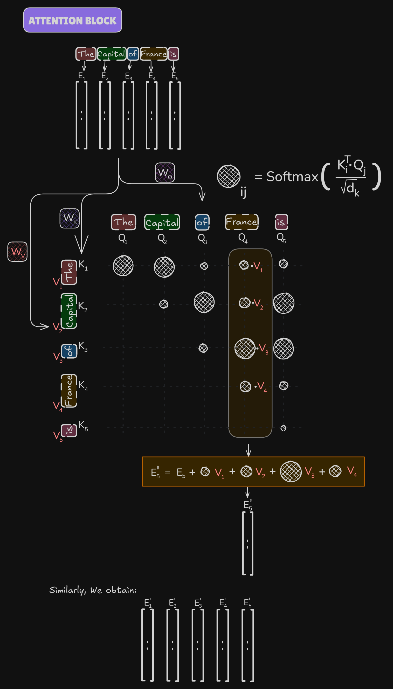
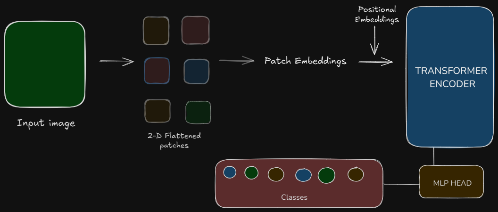

# CNNs look, ViTs pay Attention

The Transformer was first introduced in the paper *“Attention is All You Need”* by researchers at Google Brain and the University of Toronto. It was initially designed for translation tasks, but due to its flexible architecture, it is now used for a wide range of applications like chatbots, text-to-audio systems, and more.

## Attention

The chatbot model based on Transformers is trained to take a piece of text and predict the next “token.” Rather than outputting a single prediction, the Transformer assigns a probability distribution over all tokens in its vocabulary.

Chatbots like GPT work by selecting a token (usually with high probability) from the predicted distribution and appending it to the input text. This updated sequence is then fed back into the Transformer, repeating the process until the output is complete.

### Methodology

Each token’s embedding is retrieved from the embedding matrix. These embeddings are then multiplied by three different weight matrices: the Query matrix **($W_Q$)**, the Key matrix **($W_K$)**, and the Value matrix **($W_V$)**, producing the ***Queries*** ($Q_i$), ***Keys*** ($K_i$), and ***Values*** ($V_i$), respectively.

The Query and Key matrices typically reduce the dimensionality of the embedding vectors significantly (e.g., from 12,288 to 128 in GPT-3), while the Value matrix retains the original embedding dimension.
In each attention block, dot product between those ***Queries*** and ***Keys*** are calculated and each embedding is updated with the help of ***Values,*** hence passing information from one another.

The attention matrix is masked with a lower triangular matrix (causal masking), ensuring that future tokens do not influence past tokens. This is important for tasks like text generation, where predicting the next word must not rely on future context.

After the attention mechanism, all embeddings pass through a Multi-Layer Perceptron (MLP) block. Transformers consist of multiple layers of these attention and MLP blocks (96 layers in GPT-3). Finally, the last token's embedding is passed through a linear layer and softmax function to produce a probability distribution over the vocabulary.

This explains how the Transformer works in the context of a language processing task. But can this same architecture be used to classify images? Here’s where Vision Transformers come into the picture.

## Attention in Computer Vision? Meet ViTs

Vision Transformers take as input images of shape $(H,W,C)$ which are split into equal-sized patches and flattened to a size of $(N, P^2 \cdot C)$ where $(P,P)$ denotes the resolution of the input image patch and $N = H \cdot W/P^2$.

The flattened images are then mapped to D dimensions, where D refers to the encoder transformer's constant latent vector size. The output linear projections are known as patch embeddings, which are further concatenated with positional embeddings $\mathbf{E}_{\text{pos}}$.

$$
\begin{align}\mathbf{z}_0 &= [\mathbf{x}_{\text{class}} ;  \mathbf{x}_p^1 \mathbf{E}; \mathbf{x}_p^2 \mathbf{E}; \cdots; \mathbf{x}_p^N \mathbf{E}] + \mathbf{E}_{\text{pos}}, \nonumber\\\end{align}
$$

The transformer encoder consists of alternating layers of -

1. **Multiheaded Self-Attention(MSA):** This consists of multiple (say k) parallel self-attention operations, the outputs of which are concatenated and then projected. It captures the relationship between tokens in the input sequence

$$
MSA(z) = [SA_1(z); SA_2(z);\dots;SA_K(z)]U_{\text msa}
$$

     

Here $U_\text{msa}$ is a learned linear projection matrix that maps concatenated multi-head output back to model dimension $D$.

$$
z'_l = MSA(LN(z_{\text l-1})) + z_{\text l-1}
$$

1. **Multilayer Perceptron(MLP)**: The MLP is a simple feed-forward neural network that transforms and refines the output of the attention layer independently for each token. This aids in modelling complex relationships within the data.

$$
z_l = MSA(LN(z'_l)) + z'_l         
$$

Layernorm (LN) and residual connections are also applied before and after every book, respectively.

$$
y = LN(z_L)
$$

## ViTs VS CNNs?

Imagine our input image is a jigsaw puzzle. Using a CNN, which only looks at small regions of image at a time, is like examining each puzzle (token embedding) closely and gradually putting the puzzle together. Whereas ViT breaks the image into equal patches i.e. all the jigsaw puzzles can share information from the very beginning and we have a more global view while putting the puzzle together.

The concepts of locality and translational equivalence are fundamental to the working of CNNs. In ViTs only the MLP layers are local and translationally equivariant while the MAP layers are global. Furthermore, the positional encodings during initialization carry no information regarding the 2D spatial relationship of the patches.  Due to this lack of inherent inductive bias in ViTs, they do not generalize well when trained on insufficient amount of training data. Hence CNNs are preferred to ViTs for small datasets.

### References:

1. Dosovitskiy, Alexey, et al. "An image is worth 16x16 words: Transformers for image recognition at scale." *arXiv preprint arXiv:2010.11929* (2020).
2. Shah, Deval. “**Vision Transformer: What It Is & How It Works [2024 Guide]”.**
3. Raghu, Maithra, et al. "Do vision transformers see like convolutional neural networks?." *Advances in neural information processing systems* 34 (2021): 12116-12128.
4. Vaswani, Ashish, et al. "Attention is all you need." *Advances in neural information processing systems* 30 (2017)